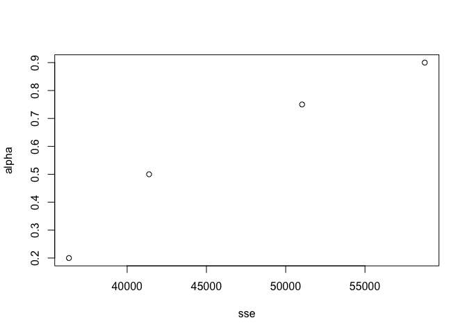
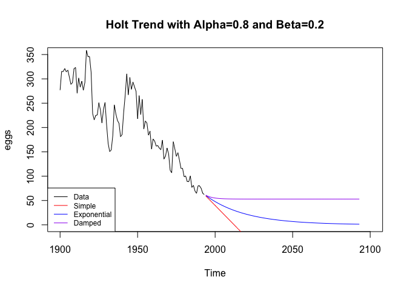
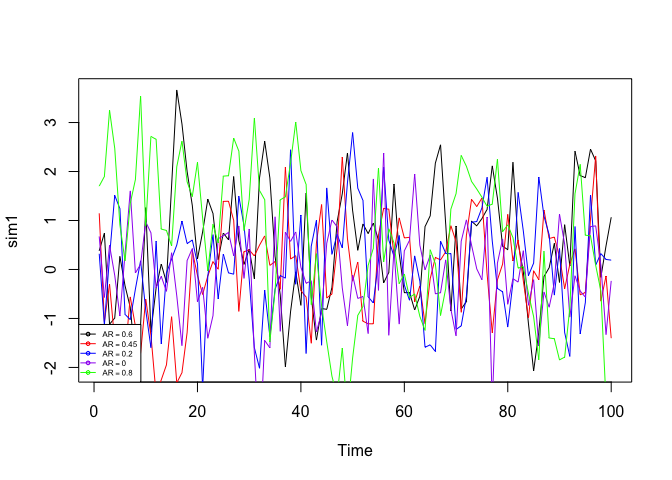

Time Series Analysis - General
================
Dalya Adams
5/6/2018

### Books contains the daily sales of paperback and hardcover books at the same store. Forecast the next four days; sales for paperback and hardcover books

``` r
library(fpp2)
```

    ## Loading required package: ggplot2

    ## Loading required package: forecast

    ## Warning in as.POSIXlt.POSIXct(Sys.time()): unknown timezone 'zone/tz/2018e.
    ## 1.0/zoneinfo/America/New_York'

    ## 
    ## Attaching package: 'forecast'

    ## The following object is masked from 'package:ggplot2':
    ## 
    ##     autolayer

    ## Loading required package: fma

    ## Loading required package: expsmooth

    ## Warning: replacing previous import 'forecast::autolayer' by
    ## 'ggplot2::autolayer' when loading 'fpp2'

``` r
data(books)
colnames(books)
```

    ## [1] "Paperback" "Hardcover"

### The seasonal trend in both hardcover and paperback sales is visible. There is a general upwward trend in hardcover sales, but not as present in paperback sales.

``` r
plot(books, main="Daily Sales of Paperback and Hardcover", ylab="Daily Sales", xlab="Time")
```


Use SES and explore different values for alpha.
-----------------------------------------------

### Paperback Sales

``` r
fit1<-ses(books[,1], alpha = 0.2, initial = "simple", h=1)
fit2<- ses(books[,1], alpha = 0.5, initial = "simple", h=1)
fit3<-ses(books[,1], alpha = 0.75, initial = "simple", h=1)
fit4<-ses(books[,1], alpha = 0.90, initial = "simple", h=1)

plot(books[,1], main="Daily Sales of Paperback", ylab="Daily Sales", xlab="Time")
lines(fitted(fit1), col="blue")
lines(fitted(fit2), col="red")
lines(fitted(fit3), col="purple")
lines(fitted(fit4), col="green")
legend("topleft", lty = 1, col = c(1,"blue", "red", "purple", "green"), 
       c("data", expression(alpha == 0.2), expression(alpha == 0.5), 
         expression(alpha == 0.75), expression(alpha == 0.9)), pch = 1, cex = 0.75)
```

 \#\#\# Hardcover Sales

``` r
fit5<-ses(books[,2], alpha = 0.2, initial = "simple", h=1)
fit6<- ses(books[,2], alpha = 0.5, initial = "simple", h=1)
fit7<-ses(books[,2], alpha = 0.75, initial = "simple", h=1)
fit8<-ses(books[,2], alpha = 0.90, initial = "simple", h=1)

plot(books[,2], main="Daily Sales of Hardback", ylab="Daily Sales", xlab="Time")
lines(fitted(fit5), col="blue")
lines(fitted(fit6), col="red")
lines(fitted(fit7), col="purple")
lines(fitted(fit8), col="green")
legend("topleft", lty = 1, col = c(1,"blue", "red", "purple", "green"), 
       c("data", expression(alpha == 0.2), expression(alpha == 0.5), 
         expression(alpha == 0.75), expression(alpha == 0.9)), pch = 1, cex = 0.75)
```


Record the within sample SSE for the one-step forecasts. Plot SSE against the alpha and find which value of alpha works best.
-----------------------------------------------------------------------------------------------------------------------------

### Paperback Sales

``` r
fit1.sse<-sum(residuals(fit1)^2)
fit2.sse<-sum(residuals(fit2)^2)
fit3.sse<-sum(residuals(fit3)^2)
fit4.sse<-sum(residuals(fit4)^2)


sse<-c(fit1.sse, fit2.sse, fit3.sse, fit4.sse)
alpha<-c(0.2, 0.5, 0.75, 0.9)

plot(sse, alpha)
```

 \#\#\#Hardcover

``` r
fit5.sse<-sum(residuals(fit5)^2)
fit6.sse<-sum(residuals(fit6)^2)
fit7.sse<-sum(residuals(fit7)^2)
fit8.sse<-sum(residuals(fit8)^2)


sse<-c(fit5.sse, fit6.sse, fit7.sse, fit8.sse)
alpha<-c(0.2, 0.5, 0.75, 0.9)

plot(sse, alpha)
```

 \#\#\#Paperback

``` r
accuracy(fit1)
```

    ##                    ME     RMSE      MAE       MPE     MAPE     MASE
    ## Training set 1.731374 34.79911 28.51298 -2.805469 16.51268 0.719023
    ##                    ACF1
    ## Training set -0.1128428

``` r
accuracy(fit2)
```

    ##                    ME     RMSE      MAE      MPE     MAPE      MASE
    ## Training set 1.620964 37.14104 31.95714 -2.67478 18.23098 0.8058757
    ##                    ACF1
    ## Training set -0.3274686

``` r
accuracy(fit3)
```

    ##                    ME     RMSE      MAE       MPE     MAPE    MASE
    ## Training set 1.555328 41.24503 34.68559 -2.781873 19.65236 0.87468
    ##                    ACF1
    ## Training set -0.4172491

``` r
accuracy(fit4)
```

    ##                   ME     RMSE     MAE       MPE    MAPE     MASE
    ## Training set 1.57004 44.26038 36.8182 -2.801562 20.6701 0.928459
    ##                    ACF1
    ## Training set -0.4567634

### Hardcover

``` r
accuracy(fit5)
```

    ##                    ME     RMSE      MAE     MPE     MAPE      MASE
    ## Training set 15.50292 33.24062 27.71224 6.01686 13.48065 0.8268056
    ##                     ACF1
    ## Training set -0.08268141

``` r
accuracy(fit6)
```

    ##                    ME     RMSE      MAE      MPE     MAPE      MASE
    ## Training set 7.115701 32.50774 25.92563 1.776891 12.93637 0.7735014
    ##                    ACF1
    ## Training set -0.2620811

``` r
accuracy(fit7)
```

    ##                    ME     RMSE      MAE       MPE   MAPE      MASE
    ## Training set 5.018773 34.74542 27.36976 0.6923409 13.805 0.8165876
    ##                    ACF1
    ## Training set -0.4438901

``` r
accuracy(fit8)
```

    ##                    ME    RMSE      MAE       MPE     MAPE      MASE
    ## Training set 4.320299 37.0628 30.11231 0.2818677 15.24951 0.8984127
    ##                    ACF1
    ## Training set -0.5483903

What is the effect of alpha on the forecasts?
---------------------------------------------

### The effect of alpha is different for the paperback sales versus the hardback sales. In reference to paperback sales, as the alpha increases, the SSE increases. This is shown in the graph, but also in the Mean Average Squared Error (MASE) presented in the summary plot.

### In contrast, the hardcover sales has a smaller SSE and MASE at aplha equals 0.5. This is visible in the graph and theaccuracy stats.

Let SES select the optimal value of alpha. Use this value to generate forecasts for the next four days.
-------------------------------------------------------------------------------------------------------

### Paperback

``` r
fit10<-ses(books[,1], initial= "simple", h=4)
plot(books[,1], xlim=c(0,35))
lines(fitted(fit10), col="blue")
lines(fit10$mean, col="green")
```


``` r
summary(fit10)
```

    ## 
    ## Forecast method: Simple exponential smoothing
    ## 
    ## Model Information:
    ## Simple exponential smoothing 
    ## 
    ## Call:
    ##  ses(y = books[, 1], h = 4, initial = "simple") 
    ## 
    ##   Smoothing parameters:
    ##     alpha = 0.2125 
    ## 
    ##   Initial states:
    ##     l = 199 
    ## 
    ##   sigma:  34.7918
    ## Error measures:
    ##                    ME     RMSE      MAE       MPE     MAPE      MASE
    ## Training set 1.749509 34.79175 28.64424 -2.770157 16.56938 0.7223331
    ##                    ACF1
    ## Training set -0.1268119
    ## 
    ## Forecasts:
    ##    Point Forecast    Lo 80    Hi 80    Lo 95    Hi 95
    ## 31       210.1537 165.5663 254.7411 141.9631 278.3443
    ## 32       210.1537 164.5706 255.7368 140.4404 279.8671
    ## 33       210.1537 163.5962 256.7112 138.9501 281.3573
    ## 34       210.1537 162.6418 257.6657 137.4905 282.8170

``` r
fit10.sse<-sum(residuals(fit10)^2)
fit10.sse
```

    ## [1] 36313.98

### Hardcover

``` r
fit11<-ses(books[,2],initial= "simple", h=4)
plot(books[,2], xlim=c(0,35))
lines(fitted(fit11), col="red")
lines(fit11$mean, col="green")
```


``` r
summary(fit11)
```

    ## 
    ## Forecast method: Simple exponential smoothing
    ## 
    ## Model Information:
    ## Simple exponential smoothing 
    ## 
    ## Call:
    ##  ses(y = books[, 2], h = 4, initial = "simple") 
    ## 
    ##   Smoothing parameters:
    ##     alpha = 0.3473 
    ## 
    ##   Initial states:
    ##     l = 139 
    ## 
    ##   sigma:  32.0198
    ## Error measures:
    ##                   ME     RMSE      MAE      MPE     MAPE      MASE
    ## Training set 9.72952 32.01982 26.34467 3.104211 13.05063 0.7860035
    ##                    ACF1
    ## Training set -0.1629042
    ## 
    ## Forecasts:
    ##    Point Forecast    Lo 80    Hi 80    Lo 95    Hi 95
    ## 31       240.3808 199.3457 281.4158 177.6231 303.1385
    ## 32       240.3808 196.9410 283.8206 173.9453 306.8162
    ## 33       240.3808 194.6625 286.0990 170.4608 310.3008
    ## 34       240.3808 192.4924 288.2691 167.1418 313.6197

``` r
fit11.sse<-sum(residuals(fit11)^2)
fit11.sse
```

    ## [1] 30758.07

### Lets see where these point lie in relation to the others

### Paperback

#### As presented in the summary stats above, the alpha is 0.1685. This alpha value corresponds with the sse value of 33944.82, which is the lowest SSE value, or the most accurate forcast.

``` r
sse<-c(fit1.sse, fit2.sse, fit3.sse, fit4.sse, fit10.sse)
alpha<-c(0.2,  0.5, 0.75, 0.9, 0.2125)

plot(sse, alpha)
```


### Hardcover

#### As for Hardcover, the alpha value is selected as 0.3283 and the SSE is 30587.69, this combination has the lowest SSE, as shown in the graph below. This point is the one on the bottom left of the scatter plot.

``` r
sse<-c(fit5.sse, fit6.sse, fit7.sse, fit8.sse, fit11.sse)
alpha<-c(0.2,  0.5, 0.75, 0.9, 0.3473)

plot(sse, alpha)
```


Repeat but with inital ="optimal". How much difference does an optimal initial level make?
------------------------------------------------------------------------------------------

### Paperback

``` r
fit1.opt<-ses(books[,1],initial = "optimal", h=4)
plot(books[,1], xlim=c(0,35))
lines(fitted(fit1.opt), col="blue")
lines(fit1.opt$mean, col="green")
```


``` r
summary(fit1.opt)
```

    ## 
    ## Forecast method: Simple exponential smoothing
    ## 
    ## Model Information:
    ## Simple exponential smoothing 
    ## 
    ## Call:
    ##  ses(y = books[, 1], h = 4, initial = "optimal") 
    ## 
    ##   Smoothing parameters:
    ##     alpha = 0.1685 
    ## 
    ##   Initial states:
    ##     l = 170.8257 
    ## 
    ##   sigma:  33.6377
    ## 
    ##      AIC     AICc      BIC 
    ## 318.9747 319.8978 323.1783 
    ## 
    ## Error measures:
    ##                    ME     RMSE     MAE       MPE     MAPE      MASE
    ## Training set 7.176212 33.63769 27.8431 0.4737524 15.57782 0.7021303
    ##                    ACF1
    ## Training set -0.2117579
    ## 
    ## Forecasts:
    ##    Point Forecast    Lo 80    Hi 80    Lo 95    Hi 95
    ## 31       207.1098 164.0013 250.2182 141.1811 273.0384
    ## 32       207.1098 163.3934 250.8261 140.2513 273.9682
    ## 33       207.1098 162.7937 251.4258 139.3342 274.8853
    ## 34       207.1098 162.2021 252.0174 138.4294 275.7901

### Paperback SSE

``` r
fit1.opt.sse<-sum(residuals(fit1.opt)^2)
fit1.opt.sse
```

    ## [1] 33944.82

Identifying the optimal start point, decreases the SSEs. The SSE with the optimal start point and optimal alpha is plotted below. This point is located on the bottom left. It is obvious that this is the best model, in regards to SSE.
-----------------------------------------------------------------------------------------------------------------------------------------------------------------------------------------------------------------------------------------

``` r
sse<-c(fit1.sse, fit2.sse, fit3.sse, fit4.sse, fit10.sse, fit1.opt.sse)
alpha<-c(0.2,  0.5, 0.75, 0.9, 0.2125, 0.1685)

plot(sse, alpha)
```


### Hardcover

``` r
fit2.opt<-ses(books[,2],initial = "optimal", h=4)
plot(books[,2], xlim=c(0,35))
lines(fitted(fit2.opt), col="red")
lines(fit2.opt$mean, col="green")
```


``` r
summary(fit2.opt)
```

    ## 
    ## Forecast method: Simple exponential smoothing
    ## 
    ## Model Information:
    ## Simple exponential smoothing 
    ## 
    ## Call:
    ##  ses(y = books[, 2], h = 4, initial = "optimal") 
    ## 
    ##   Smoothing parameters:
    ##     alpha = 0.3283 
    ## 
    ##   Initial states:
    ##     l = 149.2836 
    ## 
    ##   sigma:  31.931
    ## 
    ##      AIC     AICc      BIC 
    ## 315.8506 316.7737 320.0542 
    ## 
    ## Error measures:
    ##                    ME     RMSE     MAE      MPE     MAPE      MASE
    ## Training set 9.166918 31.93101 26.7731 2.636328 13.39479 0.7987858
    ##                    ACF1
    ## Training set -0.1417817
    ## 
    ## Forecasts:
    ##    Point Forecast    Lo 80    Hi 80    Lo 95    Hi 95
    ## 31       239.5602 198.6390 280.4815 176.9766 302.1439
    ## 32       239.5602 196.4905 282.6299 173.6908 305.4297
    ## 33       239.5602 194.4443 284.6762 170.5613 308.5591
    ## 34       239.5602 192.4869 286.6336 167.5677 311.5527

### SSE

``` r
fit2.opt.sse<-sum(residuals(fit2.opt)^2)
fit2.opt.sse
```

    ## [1] 30587.69

The improvement in hardcover is not a dramatic as with paperback books. It is still an improvement, as shown in the scatterplot below. The optimal start point and alpha is the point on the bottom left, at alpha .32 with a SSE of 30587
------------------------------------------------------------------------------------------------------------------------------------------------------------------------------------------------------------------------------------------

``` r
sse<-c(fit5.sse, fit6.sse, fit7.sse, fit8.sse, fit11.sse, fit2.opt.sse)
alpha<-c(0.2,  0.5, 0.75, 0.9, 0.3473, 0.3283)

plot(sse, alpha)
```


Apply Holt's linear method to the paperback and hardback sereis and compute four-day forecasts in each case
-----------------------------------------------------------------------------------------------------------

Paperback
---------

``` r
fit.7.2<-holt(books[,1], initial = "simple", h=4)

plot(books[,1], xlim=c(0,35))
lines(fitted(fit.7.2), col="red")
lines(fit.7.2$mean, col="blue")
```


``` r
summary(fit.7.2)
```

    ## 
    ## Forecast method: Holt's method
    ## 
    ## Model Information:
    ## Holt's method 
    ## 
    ## Call:
    ##  holt(y = books[, 1], h = 4, initial = "simple") 
    ## 
    ##   Smoothing parameters:
    ##     alpha = 0.2984 
    ##     beta  = 0.4984 
    ## 
    ##   Initial states:
    ##     l = 199 
    ##     b = -27 
    ## 
    ##   sigma:  39.5463
    ## Error measures:
    ##                    ME     RMSE     MAE      MPE     MAPE      MASE
    ## Training set 7.769844 39.54634 33.5377 1.633306 18.19621 0.8457332
    ##                    ACF1
    ## Training set -0.1088681
    ## 
    ## Forecasts:
    ##    Point Forecast    Lo 80    Hi 80     Lo 95    Hi 95
    ## 31       222.0201 171.3394 272.7007 144.51068 299.5295
    ## 32       229.6904 164.8872 294.4935 130.58245 328.7983
    ## 33       237.3606 145.1175 329.6038  96.28696 378.4343
    ## 34       245.0309 115.5211 374.5407  46.96280 443.0991

Hardback
--------

``` r
fit.7.2.2<-holt(books[,2], initial = "simple", h=4)

plot(books[,2], xlim=c(0,35))
lines(fitted(fit.7.2.2), col="red")
lines(fit.7.2.2$mean, col="blue")
```


``` r
summary(fit.7.2.2)
```

    ## 
    ## Forecast method: Holt's method
    ## 
    ## Model Information:
    ## Holt's method 
    ## 
    ## Call:
    ##  holt(y = books[, 2], h = 4, initial = "simple") 
    ## 
    ##   Smoothing parameters:
    ##     alpha = 0.439 
    ##     beta  = 0.1574 
    ## 
    ##   Initial states:
    ##     l = 139 
    ##     b = -11 
    ## 
    ##   sigma:  35.0438
    ## Error measures:
    ##                    ME     RMSE      MAE      MPE     MAPE      MASE
    ## Training set 7.193267 35.04383 27.99174 2.423793 14.18241 0.8351445
    ##                     ACF1
    ## Training set -0.07743714
    ## 
    ## Forecasts:
    ##    Point Forecast    Lo 80    Hi 80    Lo 95    Hi 95
    ## 31       250.7889 205.8784 295.6993 182.1042 319.4735
    ## 32       254.7003 202.4087 306.9918 174.7273 334.6733
    ## 33       258.6117 196.3181 320.9052 163.3419 353.8815
    ## 34       262.5231 187.9903 337.0558 148.5350 376.5111

Compare the SSE measures of Holt's method for the two sereis to those of simple exponential smoothing in the previous questions. Discuss the merits of the two forecasting methods for these data sets.
-------------------------------------------------------------------------------------------------------------------------------------------------------------------------------------------------------

Paperback
---------

``` r
fit.7.2.sse<-sum(residuals(fit.7.2)^2)
fit.7.2.sse
```

    ## [1] 46917.39

All Paperback SSEs
------------------

``` r
fit1.sse
```

    ## [1] 36329.34

``` r
fit2.sse
```

    ## [1] 41383.7

``` r
fit3.sse
```

    ## [1] 51034.58

``` r
fit4.sse
```

    ## [1] 58769.45

``` r
fit10.sse
```

    ## [1] 36313.98

``` r
fit1.opt.sse
```

    ## [1] 33944.82

Hardback
--------

``` r
fit.7.2.2.sse<-sum(residuals(fit.7.2.2)^2)
fit.7.2.2.sse
```

    ## [1] 36842.1

All Hardback SSEs
=================

``` r
fit5.sse
```

    ## [1] 33148.16

``` r
fit6.sse
```

    ## [1] 31702.6

``` r
fit7.sse
```

    ## [1] 36217.34

``` r
fit8.sse
```

    ## [1] 41209.53

``` r
fit11.sse
```

    ## [1] 30758.07

``` r
fit2.opt.sse
```

    ## [1] 30587.69

Discuss the merits of the two forecasting methods for these data sets.
----------------------------------------------------------------------

### Judging by the SSEs, Holt's method does not perform better than the optimized SES model, with SSE values of 33944.82 for paperback and 30587.69 for hardback. The Holt values for these, respectively, are 46917.39 and 36842.1.

Compare the forecasts for the two series using both methods. Which do you think is best?
----------------------------------------------------------------------------------------

### In looking at the graphs below, the holt forecast seems better, in that it captures the trend of the paperback and hardback sales. This is different from the conclusion drawn when viewing the SSE.

Paperback
---------

### Blue is Optimal SES forecast

### Red is Holts forecast

``` r
plot(books[,1], xlim=c(0,35))

lines(fit1.opt$mean, col="blue")
lines(fit.7.2$mean, col="red")
```


Hardback
========

### Blue is Optimal SES forecast

### Red is Holts forecast

``` r
plot(books[,2], xlim=c(0,35))
lines(fit2.opt$mean, col="blue")
lines(fit.7.2.2$mean, col="red")
```


Calculate the 95% prediction interval for the first forecast for each series using both methods, assuming normal errors. Compare your forecasts with those produced by R.
-------------------------------------------------------------------------------------------------------------------------------------------------------------------------

Paperback
---------

``` r
plot(fit.7.2)
```


``` r
plot(fit1.opt)
```


Hardcover
---------

``` r
plot(fit.7.2.2)
```


``` r
plot(fit2.opt)
```


Use data set eggs. Experiment with various options in the holt() function to see how much the forecasts change with damped or exponential trend. Also, try changin the parameter values for alpha and beta to see how the affect the forecasts
----------------------------------------------------------------------------------------------------------------------------------------------------------------------------------------------------------------------------------------------

``` r
data(eggs)
```

``` r
holt1<-holt(eggs, alpha=0.8, beta=0.2, initial="simple", h=100)
holt2<-holt(eggs, alpha=0.8, beta=0.2, initial="simple", exponential=TRUE, h=100)
holt3<-holt(eggs, alpha=0.8, beta=0.2, damped=TRUE, initial="optimal", h=100)
```

``` r
plot(eggs, xlim = c(1900,2100), ylim=c(0,350), main= "Holt Trend with Alpha=0.8 and Beta=0.2")
lines(holt1$mean, col="red")
lines(holt2$mean, col="blue")
lines(holt3$mean, col="purple")
legend("bottomleft", lty=1, col=c("black", "red", "blue", "purple"),
       c("Data", "Simple", "Exponential", "Damped"), cex = 0.75)
```



``` r
holt4<-holt(eggs, alpha=0.2, beta=0.8, initial="simple", h=100)
holt5<-holt(eggs, alpha=0.2, beta=0.8, initial="simple", exponential=TRUE, h=100)
holt6<-holt(eggs, damped=TRUE, initial="optimal", h=100)
```

``` r
plot(eggs, xlim = c(1900,2100), ylim=c(0,350),main= "Holt Trend with Alpha=0.2 and Beta=0.8")
lines(holt4$mean, col="red")
lines(holt5$mean, col="blue")
lines(holt6$mean, col="purple")
legend("bottomleft", lty=1, col=c("black", "red", "blue", "purple"),
       c("Data", "Simple", "Exponential", "Damped-Optimal"), cex = 0.75)
```


``` r
holt7<-holt(eggs, h=100)
holt8<-holt(eggs, exponential=TRUE, h=100)
holt10<-holt(eggs, exponential=TRUE, damped=TRUE, h=100)
```

``` r
plot(eggs, xlim = c(1900,2100), ylim=c(0,350), main= "Holt Trend with Optimal Alpha and Beta")
lines(holt7$mean, col="red")
lines(holt8$mean, col="blue")
lines(holt10$mean, col="purple")
legend("bottomleft", lty=1, col=c("black", "red", "blue", "purple"),
       c("Data", "R selected", "Exponential", "Damped"), cex = 0.75)
```

 \#\#\# Holt8 has the lowest RMSE. It is the model with exponential smoothing and R choosen the optimal alpha and beta values and no dampening. In the final graph, we can see that Holt8 is the blue line. It maintains the downward trend, but levels to a constant value.

``` r
accuracy(holt1)
```

    ##                     ME     RMSE     MAE      MPE     MAPE     MASE
    ## Training set -2.784254 29.23521 22.3058 -1.55109 11.02945 1.100312
    ##                    ACF1
    ## Training set 0.06902877

``` r
accuracy(holt2)
```

    ##                     ME    RMSE      MAE       MPE     MAPE     MASE
    ## Training set -5.415946 29.6436 22.68924 -2.986354 11.22238 1.119226
    ##                    ACF1
    ## Training set 0.06999484

``` r
accuracy(holt3)
```

    ##                     ME     RMSE      MAE      MPE     MAPE     MASE
    ## Training set -1.478575 27.71097 20.83628 -1.81307 10.60224 1.027823
    ##                     ACF1
    ## Training set -0.02909399

``` r
accuracy(holt4)
```

    ##                     ME     RMSE      MAE       MPE     MAPE     MASE
    ## Training set -2.561214 39.44921 30.14474 -1.604226 15.04488 1.486995
    ##                   ACF1
    ## Training set 0.6227753

``` r
accuracy(holt5)
```

    ##                     ME     RMSE      MAE       MPE    MAPE     MASE
    ## Training set -6.985339 40.36501 30.16092 -3.784936 14.5846 1.487793
    ##                   ACF1
    ## Training set 0.6334021

``` r
accuracy(holt6)
```

    ##                     ME     RMSE      MAE       MPE     MAPE      MASE
    ## Training set -3.092257 26.66198 19.51158 -3.023266 10.11049 0.9624771
    ##                      ACF1
    ## Training set -0.005832122

``` r
accuracy(holt7)
```

    ##                      ME     RMSE      MAE       MPE     MAPE      MASE
    ## Training set -0.2517656 26.50294 19.16922 -1.334809 9.684965 0.9455886
    ##                     ACF1
    ## Training set 0.007078776

``` r
accuracy(holt8)
```

    ##                     ME     RMSE      MAE      MPE     MAPE      MASE
    ## Training set 0.4755243 26.38645 19.22237 -1.27959 9.754134 0.9482108
    ##                    ACF1
    ## Training set 0.00705702

``` r
accuracy(holt10)
```

    ##                      ME     RMSE      MAE       MPE     MAPE      MASE
    ## Training set -0.8824596 26.52585 19.51446 -2.100753 10.01524 0.9626188
    ##                     ACF1
    ## Training set 0.005081461

Use data set ukcars. Plot the data and describe the main features of the series
-------------------------------------------------------------------------------

#### There is a strong seasonal effect in this dataset, and an inconsistent trend. In the beginning of the dataset, we see a downward trend, but it becomes an upward trend which levels out towards the end of the dataset. The most prevalent feature is the seasonal variation present in the data.

``` r
data(ukcars)
plot(ukcars, main="UK Passenger Vehicle Production Data")
```


Decompose the series using STL and obtain the seasonally adjusted data
----------------------------------------------------------------------

``` r
seas<-stl(ukcars, s.window = "periodic")
plot(seas)
```


``` r
seas.adj<-seasadj(seas)
```

Forecast the next 2 years using an additive dampened trend method applied to seasonally adjusted data. Then reseasonalize the forecasts. Record the parameters of the methods and report the RMSE of the one-step forecasts from your method.
---------------------------------------------------------------------------------------------------------------------------------------------------------------------------------------------------------------------------------------------

``` r
fcast<-holt(seas.adj, damped = TRUE, seasonal="additive", h=24, robust=TRUE)
#View(seas.adj)
accuracy(fcast)
```

    ##                    ME     RMSE      MAE      MPE     MAPE      MASE
    ## Training set 2.542419 25.13965 20.50991 0.319648 6.568478 0.6684081
    ##                    ACF1
    ## Training set 0.03469485

``` r
fcast$model
```

    ## Damped Holt's method 
    ## 
    ## Call:
    ##  holt(y = seas.adj, h = 24, damped = TRUE, seasonal = "additive",  
    ## 
    ##  Call:
    ##      robust = TRUE) 
    ## 
    ##   Smoothing parameters:
    ##     alpha = 0.5737 
    ##     beta  = 1e-04 
    ##     phi   = 0.9106 
    ## 
    ##   Initial states:
    ##     l = 342.6908 
    ##     b = -9.9556 
    ## 
    ##   sigma:  25.1396
    ## 
    ##      AIC     AICc      BIC 
    ## 1274.920 1275.712 1291.284

``` r
plot(forecast(fcast, h=24))
```


``` r
fcast2 <- forecast(seas, method="naive")
plot(fcast2)
```


Forecast the next 2 years using Holt's linear method applied to seasonally adjusted data. Then reseasonalize the forecasts. Record the parameters of the methods and report the RMSE of the one-step forecasts from your method.
--------------------------------------------------------------------------------------------------------------------------------------------------------------------------------------------------------------------------------

``` r
fcast3<-holt(seas.adj, initial = "simple", h=24, robust=TRUE)
#View(seas.adj)
accuracy(fcast3)
```

    ##                     ME     RMSE      MAE      MPE     MAPE      MASE
    ## Training set -2.669845 28.70238 22.50912 -1.16915 7.324064 0.7335612
    ##                      ACF1
    ## Training set -0.008396094

``` r
fcast3$model
```

    ## Holt's method 
    ## 
    ## Call:
    ##  holt(y = seas.adj, h = 24, initial = "simple", robust = TRUE) 
    ## 
    ##   Smoothing parameters:
    ##     alpha = 0.7505 
    ##     beta  = 0.2054 
    ## 
    ##   Initial states:
    ##     l = 304.7042 
    ##     b = 45.3325 
    ## 
    ##   sigma:  28.7024

``` r
linpred<-forecast(fcast3, h=24)
plot(forecast(fcast3, h=24))
```


``` r
fcast4 <- forecast(seas, method= "naive", h=24)
plot(fcast4)
```


``` r
summary(fcast4)
```

    ## 
    ## Forecast method: STL +  Random walk
    ## 
    ## Model Information:
    ## Call: rwf(y = x, h = h, drift = FALSE, level = level) 
    ## 
    ## Residual sd: 26.945 
    ## 
    ## Error measures:
    ##                     ME     RMSE     MAE        MPE     MAPE      MASE
    ## Training set 0.9145089 26.84003 21.2837 -0.1849312 6.965207 0.6936254
    ##                    ACF1
    ## Training set -0.3048612
    ## 
    ## Forecasts:
    ##         Point Forecast    Lo 80    Hi 80    Lo 95    Hi 95
    ## 2005 Q2       428.1435 393.7467 462.5404 375.5381 480.7490
    ## 2005 Q3       362.0045 313.3599 410.6490 287.6091 436.3999
    ## 2005 Q4       405.5729 345.9958 465.1500 314.4575 496.6883
    ## 2006 Q1       432.7960 364.0022 501.5898 327.5850 538.0070
    ## 2006 Q2       428.1435 351.2298 505.0573 310.5141 545.7730
    ## 2006 Q3       362.0045 277.7497 446.2593 233.1479 490.8611
    ## 2006 Q4       405.5729 314.5673 496.5785 266.3919 544.7539
    ## 2007 Q1       432.7960 335.5069 530.0851 284.0052 581.5868
    ## 2007 Q2       428.1435 324.9529 531.3342 270.3271 585.9600
    ## 2007 Q3       362.0045 253.2320 470.7769 195.6513 528.3576
    ## 2007 Q4       405.5729 291.4914 519.6544 231.1002 580.0456
    ## 2008 Q1       432.7960 313.6417 551.9503 250.5652 615.0268
    ## 2008 Q2       428.1435 304.1238 552.1633 238.4718 617.8153
    ## 2008 Q3       362.0045 233.3031 490.7058 165.1728 558.8362
    ## 2008 Q4       405.5729 272.3544 538.7914 201.8327 609.3131
    ## 2009 Q1       432.7960 295.2085 570.3835 222.3741 643.2179
    ## 2009 Q2       428.1435 286.3216 569.9655 211.2456 645.0415
    ## 2009 Q3       362.0045 216.0709 507.9381 138.8183 585.1906
    ## 2009 Q4       405.5729 255.6404 555.5054 176.2709 634.8749
    ## 2010 Q1       432.7960 278.9685 586.6235 197.5371 668.0549
    ## 2010 Q2       428.1435 270.5172 585.7698 187.0749 669.2122
    ## 2010 Q3       362.0045 200.6688 523.3401 115.2629 608.7461
    ## 2010 Q4       405.5729 240.6113 570.5345 153.2859 657.8600
    ## 2011 Q1       432.7960 264.2864 601.3056 175.0828 690.5092

Now use the ets() to choose a seasonal model for the data.
----------------------------------------------------------

``` r
fets<- ets(ukcars)
summary(fets)
```

    ## ETS(A,N,A) 
    ## 
    ## Call:
    ##  ets(y = ukcars) 
    ## 
    ##   Smoothing parameters:
    ##     alpha = 0.6267 
    ##     gamma = 1e-04 
    ## 
    ##   Initial states:
    ##     l = 313.0916 
    ##     s=-1.1271 -44.606 21.5553 24.1778
    ## 
    ##   sigma:  25.2579
    ## 
    ##      AIC     AICc      BIC 
    ## 1277.980 1279.047 1297.072 
    ## 
    ## Training set error measures:
    ##                    ME     RMSE      MAE        MPE     MAPE      MASE
    ## Training set 1.324962 25.25792 20.12508 -0.1634983 6.609629 0.6558666
    ##                    ACF1
    ## Training set 0.01909295

``` r
plot(forecast(fets, h=24))
```


Compare the RMSE of the fitted model with the RMSE of the model you obtained using STL Decomposition with Holt's Methos. Which gives the better in-sample fits?
---------------------------------------------------------------------------------------------------------------------------------------------------------------

### The RMSE for the Holt method on the seasonally adjusted data is better than the naive forecast on the seasonal data. The ETS model selected by the ets() fit has a competitive RMSE to the Holt method on the seasonally adjsuted data.

``` r
accuracy(fets)
```

    ##                    ME     RMSE      MAE        MPE     MAPE      MASE
    ## Training set 1.324962 25.25792 20.12508 -0.1634983 6.609629 0.6558666
    ##                    ACF1
    ## Training set 0.01909295

``` r
accuracy(fcast)
```

    ##                    ME     RMSE      MAE      MPE     MAPE      MASE
    ## Training set 2.542419 25.13965 20.50991 0.319648 6.568478 0.6684081
    ##                    ACF1
    ## Training set 0.03469485

``` r
accuracy(fcast4)
```

    ##                     ME     RMSE     MAE        MPE     MAPE      MASE
    ## Training set 0.9145089 26.84003 21.2837 -0.1849312 6.965207 0.6936254
    ##                    ACF1
    ## Training set -0.3048612

Compare the forecasts from the two approaches? Which seems most reasonable?
---------------------------------------------------------------------------

### In viewing the forecasted results, the ETS model has a smaller prediction interval and is slightly more accuracte than the reseasonalized prediction (fcast4) in all accuracy measures, except ME.

Use R to simulate and plot some data from simple ARIMA models
-------------------------------------------------------------

Generate data from an AR(1) model with theta=0.6 and sigma squared = 1. Start with y0=0
---------------------------------------------------------------------------------------

### theta = ar ,Y0= c, sqrt(sigma^2) = sd

``` r
sim1<-arima.sim(list( ar=0.6, sd=sqrt(1), c=0), n=100)
```

Produce a time plot for the series. How does the plot change as you change theta?
---------------------------------------------------------------------------------

``` r
plot(sim1)
```


``` r
sim1<-arima.sim(list( ar=0.6, sd=sqrt(1), c=0), n=100)
sim1.1 <-arima.sim(list( ar=.45, sd=sqrt(1), c=0), n=100)
sim1.2 <-arima.sim(list( ar=0.2, sd=sqrt(1), c=0), n=100)
sim1.3 <-arima.sim(list( ar=0, sd=sqrt(1), c=0), n=100)
```

    ## Warning in min(Mod(polyroot(c(1, -model$ar)))): no non-missing arguments to
    ## min; returning Inf

``` r
sim1.4 <-arima.sim(list( ar=.80, sd=sqrt(1), c=0), n=100)
```

### Well, that looks like abstract art

``` r
plot(sim1)
lines(sim1.1, col="red")
lines(sim1.2, col= "blue")
lines(sim1.3, col="purple")
lines(sim1.4, col= "green")
legend("bottomleft", lty = 1, col = c(1, "red","blue", "purple", "green"), 
       c(expression(AR==0.6), expression(AR==0.45), expression(AR==0.20), 
         expression(AR==0.0), expression(AR==0.80)), pch = 1, cex = 0.50)
```



``` r
plot(sim1)
lines(sim1.1, col="red")
legend("bottomleft", lty = 1, col = c(1, "red"), c(expression(AR==0.6), 
                                                   expression(AR==0.45)), 
       pch = 1, cex = 0.70)
```


``` r
plot(sim1)
lines(sim1.2, col= "blue")
legend("bottomleft", lty = 1, col = c(1, "blue"), 
       c(expression(AR==0.6),  expression(AR==0.20)), pch = 1, cex = 0.70)
```


``` r
plot(sim1)
lines(sim1.3, col="purple")
legend("bottomleft", lty = 1, col = c(1, "purple"), 
       c(expression(AR==0.6),  expression(AR==0.0)), pch = 1, cex = 0.70)
```


``` r
plot(sim1)
lines(sim1.4, col= "green")
legend("bottomleft", lty = 1, col = c(1,"green"), 
       c(expression(AR==0.6),  expression(AR==0.80)), pch = 1, cex = 0.70)
```


Generate data from an MA(1) model with theta = 0.6, and sigma squared = 1, start with e0=0.
-------------------------------------------------------------------------------------------

``` r
sim2<-arima.sim(list( ma=0.6, sd=sqrt(1), c=0), n=100)
```

Produce a time plot for the sereis. How does the plot change as you change the theta
------------------------------------------------------------------------------------

``` r
plot(sim2)
```


``` r
sim2<-arima.sim(list( ma=0.6, sd=sqrt(1), c=0), n=100)
sim2.1<-arima.sim(list( ma=-1.0, sd=sqrt(1), c=0), n=100)
sim2.2<-arima.sim(list( ma=1.0, sd=sqrt(1), c=0), n=100)
sim2.3<-arima.sim(list( ma=-0.50, sd=sqrt(1), c=0), n=100)
sim2.4<-arima.sim(list( ma=0.50, sd=sqrt(1), c=0), n=100)
```

``` r
plot(sim2)
lines(sim2.1, col="red")
lines(sim2.2, col= "blue")
lines(sim2.3, col="purple")
lines(sim2.4, col= "green")
legend("bottomleft", lty = 1, col = c(1, "red","blue", "purple", "green"), 
       c(expression(MA==0.6), expression(MA==-1.0), 
         expression(MA==1.00), expression(MA==-0.50), expression(MA==0.50)), 
       pch = 1, cex = 0.50)
```


``` r
plot(sim2)
lines(sim2.1, col="red")
legend("bottomleft", lty = 1, col = c(1, "red"), 
       c(expression(MA==0.6), expression(MA==-1.0)), 
       pch = 1, cex = 0.50)
```


``` r
plot(sim2)
lines(sim2.2, col= "blue")
legend("bottomleft", lty = 1, col = c(1, "blue"), 
       c(expression(MA==0.6),  expression(MA==1.00)), pch = 1, cex = 0.50)
```


``` r
plot(sim2)
lines(sim2.3, col="purple")
legend("bottomleft", lty = 1, col = c(1,  "purple"), 
       c(expression(MA==0.6),  expression(MA==-0.50)), pch = 1, cex = 0.50)
```


``` r
plot(sim2)
lines(sim2.4, col= "green")
legend("bottomleft", lty = 1, col = c(1 ,"green"), 
       c(expression(MA==0.6),  expression(MA==0.50)), pch = 1, cex = 0.50)
```


Generate data from an ARMA (1,1) model with AR=0.6 and MA=0.6 and sd=sqrt(1). Start with y0=y-1=0
-------------------------------------------------------------------------------------------------

``` r
sim3<-arima.sim(list( ar=0.6, ma=0.6, sd=sqrt(1), c=0), n=100)
```

Generate data from an AR(2) model with AR=-0.8 and 0.3 and sd=sqrt(1). STart with y0=y-1=0
------------------------------------------------------------------------------------------

``` r
sim4<-arima.sim(list( ar=c( 0.3,-0.8), sd=sqrt(1), c=0), n=100)
```

Graph the latter two series and compare them.
---------------------------------------------

### The ARMA with values (-.8,.3) primarily stays centered around 0. It does show ebbs and flows, but is lacking the peaks seen in the ARMA with values (.6,.6). With this ARMA model, the model is centered around 0, but with extreme peaks and dips. TO stay centered around 0, these extreme peaks are followed by extreme dips.

``` r
plot(sim3)
lines(sim4, col="red")
legend("bottomleft", lty = 1, col = c(1 ,"red"), 
       c(expression(AR/MA==0.6),  expression(AR==0.3/-0.8)), pch = 1, cex = 0.70)
```


Data set wmurders
-----------------

``` r
data(wmurders)
```

By studying appropriate graphs of the series in R, find an appropriate ARIMA(p,d,q) model for these data
--------------------------------------------------------------------------------------------------------

### In looking at the plot, we first notice the model is not stationary. We'll take the first difference to try and make it stationary.

``` r
plot(wmurders)
```


``` r
par(mfrow=c(1,2))
acf(wmurders)
pacf(wmurders)
```


``` r
plot(diff(wmurders, 1))
```


``` r
par(mfrow=c(1,2))
acf(diff(wmurders, 1))
pacf(diff(wmurders, 1))
```


``` r
plot(diff(diff(wmurders, 1),2))
```

 \#\#AR

``` r
par(mfrow=c(1,2))
acf(diff(diff(wmurders, 1),2))
pacf(diff(diff(wmurders, 1),2))
```

 \#\#Yeah! I got it right!!

``` r
ndiffs(wmurders)
```

    ## [1] 2

Now lets try and build this model
---------------------------------

``` r
dif2<-diff(diff(wmurders, 1),2)
```

ARIMA(1,2,2)?

``` r
par(mfrow=c(1,2))
acf(dif2)
pacf(dif2)
```


``` r
fitA1<-Arima(wmurders, order = c(1,2,3))
summary(fitA1)
```

    ## Series: wmurders 
    ## ARIMA(1,2,3) 
    ## 
    ## Coefficients:
    ##           ar1      ma1     ma2      ma3
    ##       -0.0931  -0.9317  0.3287  -0.2880
    ## s.e.   0.5181   0.4973  0.6336   0.2482
    ## 
    ## sigma^2 estimated as 0.04565:  log likelihood=7.79
    ## AIC=-5.58   AICc=-4.3   BIC=4.27
    ## 
    ## Training set error measures:
    ##                      ME      RMSE       MAE        MPE     MAPE      MASE
    ## Training set -0.0131169 0.2016676 0.1521779 -0.3198772 4.361731 0.9358229
    ##                     ACF1
    ## Training set -0.02486969

``` r
fitA<-Arima(wmurders, order = c(2,2,3))
summary(fitA)
```

    ## Series: wmurders 
    ## ARIMA(2,2,3) 
    ## 
    ## Coefficients:
    ##          ar1      ar2      ma1     ma2      ma3
    ##       0.3500  -0.5222  -1.3508  1.3963  -0.9200
    ## s.e.  0.1449   0.1360   0.0882  0.1258   0.1069
    ## 
    ## sigma^2 estimated as 0.03965:  log likelihood=10.03
    ## AIC=-8.05   AICc=-6.23   BIC=3.77
    ## 
    ## Training set error measures:
    ##                       ME      RMSE       MAE        MPE     MAPE      MASE
    ## Training set -0.01353027 0.1860191 0.1378711 -0.3377097 3.997824 0.8478428
    ##                    ACF1
    ## Training set -0.1087861

Should you include a constant in the model? Explain.
----------------------------------------------------

### The model that i've selected above has a d&gt;1, so adding a constant is particularly dangerous when forecasting.

Fit the model using R and examine the residuals. Is the model satisfactory?
---------------------------------------------------------------------------

### The model appears to be satisfactory. There are no significant spikes in the ACF or PACF and the residuals appear to be white noise.

``` r
tsdisplay(residuals(fitA))
```


Forecast three times ahead.
---------------------------

``` r
forecast(fitA, h=3)
```

    ##      Point Forecast    Lo 80    Hi 80    Lo 95    Hi 95
    ## 2005       2.280465 2.021042 2.539888 1.883712 2.677218
    ## 2006       2.187847 1.819820 2.555873 1.624999 2.750694
    ## 2007       2.220101 1.684602 2.755600 1.401126 3.039076

Create a plot of the series with forecasts and prediction intervals for the next three periods shown.
-----------------------------------------------------------------------------------------------------

``` r
plot(forecast(fitA, h=3))
```


Does auto.arima give the same model you have chosen? If not, which model do you think is better?
------------------------------------------------------------------------------------------------

### The Auto.Arima model did not choose the same model. If we base our selected on the smallest AICc, we choose the auto.arima model. If we go based off of the RMSE, we choose the ARIMA(2,2,3). Since the models are different, we will use the RMSE and go with the handcrafted ARIMA(2,2,3) model.

``` r
aafit<-auto.arima(wmurders)
summary(aafit)
```

    ## Series: wmurders 
    ## ARIMA(1,2,1) 
    ## 
    ## Coefficients:
    ##           ar1      ma1
    ##       -0.2434  -0.8261
    ## s.e.   0.1553   0.1143
    ## 
    ## sigma^2 estimated as 0.04632:  log likelihood=6.44
    ## AIC=-6.88   AICc=-6.39   BIC=-0.97
    ## 
    ## Training set error measures:
    ##                       ME      RMSE       MAE        MPE     MAPE      MASE
    ## Training set -0.01065956 0.2072523 0.1528734 -0.2149476 4.335214 0.9400996
    ##                    ACF1
    ## Training set 0.02176343

Find the latest data and compare with your forecasts.
-----------------------------------------------------

``` r
forecast(fitA, h=3)
```

    ##      Point Forecast    Lo 80    Hi 80    Lo 95    Hi 95
    ## 2005       2.280465 2.021042 2.539888 1.883712 2.677218
    ## 2006       2.187847 1.819820 2.555873 1.624999 2.750694
    ## 2007       2.220101 1.684602 2.755600 1.401126 3.039076

### The latest data isn't present on the website.

Dataset austourists
-------------------

``` r
data("austourists")
```

Describe the time plot.
-----------------------

### This dataset has strong seasonal trend, and a general upward trend.

``` r
plot(austourists)
```


### The ACF Plot shows the relationship between yt and y(t-k). So this ACF shows us that the value of yt is impacted by previous values, specifically, 1 year prior. The seasonal impact is likely yearly in this quarterly dataset. We also can learn that the dataset is not stationary, which we noticed in the plot of the data.

``` r
acf(austourists)
```


### The PACF shows us the relationship of yt to y(t-k) after removing the effects of other time lags prior to y(t-k). We notice the same yearly spikes in the PACF and the non stationary aspect of the dataset.

``` r
pacf(austourists)
```


Produce plots of the seasonally differenced data (1-B^4)Yt.
-----------------------------------------------------------

``` r
#seasd<-seasadj(stl(austourists, s.window = "periodic"))
tsdisplay(diff(austourists, lag = 4, differences = 1))
```

 \#\#What model do these graphs suggest? \#\#\# The significant lag at 1 in the ACF suggests a non-seasonal MA(1), the significant spike at 4 in the ACF suggests a seasonal MA(1) component. So we being with a ARIMA (0,1,1)(0,1,1)\[4\] model. The PACF shows a significant spike at 1,4 and 5. The spike at 4 is consistent with teh seasonal nature of the data. We end with a ARIMA (1,1,1)(1,1,1)\[4\] model.

### The auto arima model chose a different model than the one I selected. In running the model I selected, the model selected by the auto.arima is better, as measured by the smaller AICc and smaller RMSE

``` r
aa8.7<-auto.arima(austourists)
summary(aa8.7)
```

    ## Series: austourists 
    ## ARIMA(1,0,0)(1,1,0)[4] with drift 
    ## 
    ## Coefficients:
    ##          ar1     sar1   drift
    ##       0.4705  -0.5305  0.5489
    ## s.e.  0.1154   0.1122  0.0864
    ## 
    ## sigma^2 estimated as 5.15:  log likelihood=-142.48
    ## AIC=292.97   AICc=293.65   BIC=301.6
    ## 
    ## Training set error measures:
    ##                      ME     RMSE      MAE        MPE     MAPE      MASE
    ## Training set 0.02200144 2.149384 1.620917 -0.7072593 4.388288 0.5378929
    ##                     ACF1
    ## Training set -0.06393238

``` r
aamy<-Arima(austourists, order = c(1,1,1), seasonal = c(1,1,1))
summary(aamy)
```

    ## Series: austourists 
    ## ARIMA(1,1,1)(1,1,1)[4] 
    ## 
    ## Coefficients:
    ##          ar1      ma1     sar1     sma1
    ##       0.4023  -0.9202  -0.4463  -0.1153
    ## s.e.  0.1548   0.0785   0.2258   0.2442
    ## 
    ## sigma^2 estimated as 5.403:  log likelihood=-142.05
    ## AIC=294.1   AICc=295.15   BIC=304.82
    ## 
    ## Training set error measures:
    ##                     ME     RMSE      MAE       MPE     MAPE      MASE
    ## Training set 0.1596318 2.165125 1.699392 -0.305583 4.588511 0.5639345
    ##                     ACF1
    ## Training set -0.07172687

Dataset usmelec. In general there are two peaks per year: mid-summer and mid-winter.
------------------------------------------------------------------------------------

``` r
data("usmelec")
```

Examine the 12 month moving average of this series to see what kind of trend is involved.
-----------------------------------------------------------------------------------------

``` r
plot(usmelec)
```


``` r
ma12<-ma(usmelec, 12)
plot(usmelec)
lines(ma12, col="blue")
```


The seasonal effect of the data increases as time goes on. This dataset will likely benefit from a log transofrmaiton, which will remove the increased varaince of the later observations.
------------------------------------------------------------------------------------------------------------------------------------------------------------------------------------------

``` r
lusmelec<-log(usmelec)
lma12<-ma(lusmelec, 12)
plot(lusmelec)
lines(lma12, col="blue")
```


### The data is not stationary, but a single difference appears to make the dataset stationary.

``` r
tsdisplay(diff(lusmelec, lag = 12, differences = 1))
```


``` r
tsdisplay(diff(diff(lusmelec, lag = 12, differences = 1)))
```


### In looking at the ACF and PACF, we see exponential decay in the ACF, with a significant spike at 12. In the PACF, There is a significant lag at 1,3, 11,12,13,23,24,25,36.

### PACF is AR -- ARIMA(AR,D,MA)

### ARIMA(2,0,0)(3,1,1)\[12\] is the best model of the ones tested below, based off of the AIC, AICc and BIC.

``` r
arima1<-Arima(lusmelec, order = c(2,0,0), seasonal = c(3,1,1))
summary(arima1)
```

    ## Series: lusmelec 
    ## ARIMA(2,0,0)(3,1,1)[12] 
    ## 
    ## Coefficients:
    ##          ar1     ar2     sar1     sar2     sar3     sma1
    ##       0.7316  0.2502  -0.0635  -0.1544  -0.1081  -0.7714
    ## s.e.  0.0455  0.0446   0.0615   0.0548   0.0535   0.0488
    ## 
    ## sigma^2 estimated as 0.0007709:  log likelihood=1021.09
    ## AIC=-2028.19   AICc=-2027.95   BIC=-1999.06
    ## 
    ## Training set error measures:
    ##                      ME       RMSE        MAE        MPE      MAPE
    ## Training set 0.00211664 0.02724639 0.02078942 0.03755393 0.3755733
    ##                   MASE        ACF1
    ## Training set 0.5928503 -0.06465986

``` r
arima2<-Arima(lusmelec, order = c(2,1,3), seasonal = c(3,1,1))
summary(arima2)
```

    ## Series: lusmelec 
    ## ARIMA(2,1,3)(3,1,1)[12] 
    ## 
    ## Coefficients:
    ##          ar1     ar2      ma1      ma2     ma3     sar1     sar2     sar3
    ##       0.0685  0.1786  -0.4894  -0.3782  0.0649  -0.0360  -0.1315  -0.1049
    ## s.e.  0.4525  0.1605   0.4516   0.3066  0.1077   0.0663   0.0576   0.0559
    ##          sma1
    ##       -0.7744
    ## s.e.   0.0506
    ## 
    ## sigma^2 estimated as 0.0006827:  log likelihood=1049.54
    ## AIC=-2079.07   AICc=-2078.6   BIC=-2037.48
    ## 
    ## Training set error measures:
    ##                         ME       RMSE        MAE         MPE     MAPE
    ## Training set -0.0009605182 0.02553068 0.01961125 -0.01836626 0.354044
    ##                   MASE         ACF1
    ## Training set 0.5592525 -0.003915312

``` r
arima2<-Arima(lusmelec, order = c(2,1,2), seasonal = c(3,1,1))
summary(arima2)
```

    ## Series: lusmelec 
    ## ARIMA(2,1,2)(3,1,1)[12] 
    ## 
    ## Coefficients:
    ##           ar1     ar2      ma1      ma2     sar1     sar2     sar3
    ##       -0.1367  0.1720  -0.2815  -0.4610  -0.0401  -0.1330  -0.1048
    ## s.e.   0.3037  0.1474   0.2967   0.2547   0.0657   0.0575   0.0559
    ##          sma1
    ##       -0.7742
    ## s.e.   0.0504
    ## 
    ## sigma^2 estimated as 0.0006816:  log likelihood=1049.38
    ## AIC=-2080.76   AICc=-2080.38   BIC=-2043.33
    ## 
    ## Training set error measures:
    ##                         ME      RMSE        MAE         MPE     MAPE
    ## Training set -0.0009413485 0.0255378 0.01961076 -0.01802902 0.354006
    ##                   MASE         ACF1
    ## Training set 0.5592386 -0.006891814

Estimate the parameters of your best model and do diagnostic testing on the residuals. Do the residuals resemble white noise? If not, try to find another ARIMA model which fits better.
----------------------------------------------------------------------------------------------------------------------------------------------------------------------------------------

``` r
summary(arima1)
```

    ## Series: lusmelec 
    ## ARIMA(2,0,0)(3,1,1)[12] 
    ## 
    ## Coefficients:
    ##          ar1     ar2     sar1     sar2     sar3     sma1
    ##       0.7316  0.2502  -0.0635  -0.1544  -0.1081  -0.7714
    ## s.e.  0.0455  0.0446   0.0615   0.0548   0.0535   0.0488
    ## 
    ## sigma^2 estimated as 0.0007709:  log likelihood=1021.09
    ## AIC=-2028.19   AICc=-2027.95   BIC=-1999.06
    ## 
    ## Training set error measures:
    ##                      ME       RMSE        MAE        MPE      MAPE
    ## Training set 0.00211664 0.02724639 0.02078942 0.03755393 0.3755733
    ##                   MASE        ACF1
    ## Training set 0.5928503 -0.06465986

### The ACF and PACF show that there is still correlation left in the residuals. A better model will be estimated. The ACF and PACF both show significant spikes at 2 and 10.

``` r
tsdisplay(residuals(arima1))
```

 \#\#P-values are extremely small, so the residuals are distinguishable from white noise. Prediciton can be used by not the forecast intervals.

``` r
Box.test(residuals(arima1), lag = 12, fitdf = 6, type = "Ljung")
```

    ## 
    ##  Box-Ljung test
    ## 
    ## data:  residuals(arima1)
    ## X-squared = 45.041, df = 6, p-value = 4.594e-08

#### ARIMA (3,0,0)(1,1,1)\[12\]

``` r
arima4<-Arima(lusmelec, order = c(3,0,0), seasonal = c(1,1,1))
summary(arima4)
```

    ## Series: lusmelec 
    ## ARIMA(3,0,0)(1,1,1)[12] 
    ## 
    ## Coefficients:
    ##          ar1     ar2     ar3    sar1     sma1
    ##       0.6613  0.0748  0.2491  0.0600  -0.8394
    ## s.e.  0.0458  0.0537  0.0451  0.0547   0.0308
    ## 
    ## sigma^2 estimated as 0.0007402:  log likelihood=1031.55
    ## AIC=-2051.09   AICc=-2050.91   BIC=-2026.13
    ## 
    ## Training set error measures:
    ##                       ME       RMSE       MAE        MPE      MAPE
    ## Training set 0.001762829 0.02672695 0.0204812 0.03102697 0.3699123
    ##                   MASE        ACF1
    ## Training set 0.5840607 -0.02444075

#### ARIMA (2,0,1)(1,1,1)\[12\]

``` r
arima5<-Arima(lusmelec, order = c(2,0,1), seasonal = c(3,1,1))
summary(arima5)
```

    ## Series: lusmelec 
    ## ARIMA(2,0,1)(3,1,1)[12] 
    ## 
    ## Coefficients:
    ##          ar1      ar2      ma1     sar1     sar2     sar3     sma1
    ##       1.4095  -0.4104  -0.8454  -0.0427  -0.1366  -0.1010  -0.7755
    ## s.e.  0.0621   0.0618   0.0352   0.0651   0.0570   0.0555   0.0497
    ## 
    ## sigma^2 estimated as 0.0006811:  log likelihood=1051.32
    ## AIC=-2086.64   AICc=-2086.33   BIC=-2053.35
    ## 
    ## Training set error measures:
    ##                        ME       RMSE        MAE         MPE      MAPE
    ## Training set 0.0001133247 0.02558203 0.01968217 0.001622631 0.3554641
    ##                  MASE       ACF1
    ## Training set 0.561275 0.01110217

``` r
arima7<-Arima(lusmelec, order = c(2,0,1), seasonal = c(3,1,1))
summary(arima7)
```

    ## Series: lusmelec 
    ## ARIMA(2,0,1)(3,1,1)[12] 
    ## 
    ## Coefficients:
    ##          ar1      ar2      ma1     sar1     sar2     sar3     sma1
    ##       1.4095  -0.4104  -0.8454  -0.0427  -0.1366  -0.1010  -0.7755
    ## s.e.  0.0621   0.0618   0.0352   0.0651   0.0570   0.0555   0.0497
    ## 
    ## sigma^2 estimated as 0.0006811:  log likelihood=1051.32
    ## AIC=-2086.64   AICc=-2086.33   BIC=-2053.35
    ## 
    ## Training set error measures:
    ##                        ME       RMSE        MAE         MPE      MAPE
    ## Training set 0.0001133247 0.02558203 0.01968217 0.001622631 0.3554641
    ##                  MASE       ACF1
    ## Training set 0.561275 0.01110217

significant spikes at 9 and 15, missing some non seasonal
=========================================================

``` r
tsdisplay(residuals(arima7))
```


``` r
arima8<-Arima(lusmelec, order = c(3,0,2), seasonal = c(3,1,1))
summary(arima8)
```

    ## Series: lusmelec 
    ## ARIMA(3,0,2)(3,1,1)[12] 
    ## 
    ## Coefficients:
    ##          ar1     ar2      ar3      ma1      ma2     sar1     sar2     sar3
    ##       0.8566  0.3135  -0.1718  -0.2763  -0.4628  -0.0402  -0.1327  -0.1048
    ## s.e.  0.2399  0.3531   0.1301   0.2356   0.2100   0.0661   0.0577   0.0586
    ##          sma1
    ##       -0.7730
    ## s.e.   0.0513
    ## 
    ## sigma^2 estimated as 0.0006824:  log likelihood=1051.98
    ## AIC=-2083.96   AICc=-2083.49   BIC=-2042.35
    ## 
    ## Training set error measures:
    ##                        ME       RMSE       MAE         MPE      MAPE
    ## Training set 0.0001822759 0.02555216 0.0196574 0.002866167 0.3549809
    ##                   MASE         ACF1
    ## Training set 0.5605684 -0.003147958

``` r
tsdisplay(residuals(arima8))
```


``` r
arima9<-Arima(lusmelec, order = c(2,1,3), seasonal = c(3,1,1))
summary(arima9)
```

    ## Series: lusmelec 
    ## ARIMA(2,1,3)(3,1,1)[12] 
    ## 
    ## Coefficients:
    ##          ar1     ar2      ma1      ma2     ma3     sar1     sar2     sar3
    ##       0.0685  0.1786  -0.4894  -0.3782  0.0649  -0.0360  -0.1315  -0.1049
    ## s.e.  0.4525  0.1605   0.4516   0.3066  0.1077   0.0663   0.0576   0.0559
    ##          sma1
    ##       -0.7744
    ## s.e.   0.0506
    ## 
    ## sigma^2 estimated as 0.0006827:  log likelihood=1049.54
    ## AIC=-2079.07   AICc=-2078.6   BIC=-2037.48
    ## 
    ## Training set error measures:
    ##                         ME       RMSE        MAE         MPE     MAPE
    ## Training set -0.0009605182 0.02553068 0.01961125 -0.01836626 0.354044
    ##                   MASE         ACF1
    ## Training set 0.5592525 -0.003915312

``` r
tsdisplay(residuals(arima9))
```

 \#\#\#What does the auto arima say it should be?

``` r
aa<-auto.arima(usmelec)
summary(aa)
```

    ## Series: usmelec 
    ## ARIMA(1,0,2)(0,1,1)[12] with drift 
    ## 
    ## Coefficients:
    ##          ar1      ma1      ma2     sma1   drift
    ##       0.9717  -0.4374  -0.2774  -0.7061  0.3834
    ## s.e.  0.0163   0.0483   0.0493   0.0310  0.0868
    ## 
    ## sigma^2 estimated as 57.67:  log likelihood=-1635.13
    ## AIC=3282.26   AICc=3282.44   BIC=3307.22
    ## 
    ## Training set error measures:
    ##                         ME     RMSE      MAE        MPE     MAPE      MASE
    ## Training set -6.778489e-05 7.460306 5.564703 -0.0698123 2.074949 0.6179747
    ##                     ACF1
    ## Training set 0.007817298

``` r
tsdisplay(residuals(aa))
```


Forecast the next 15 years.
---------------------------

``` r
plot(forecast(arima7), n=180)
```


### The further from the last observation we get, the less accurate and reliable the forecast is likely to be. Since we are forecasting 15 years into the future, the forecasts from year 10 on, may be highly suspect. Another issue to be wary about is the prediction intervals. Since I was unable to account for all significant spikes in building a seasonal ARIMA model, the prediction intervals should not be relied upon. The forecasts can be relied upon.
